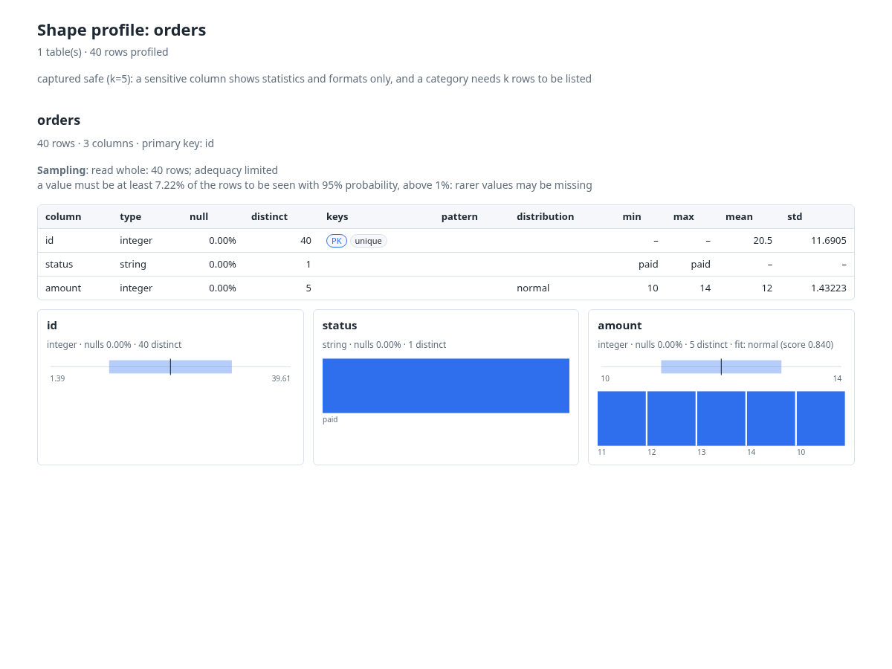
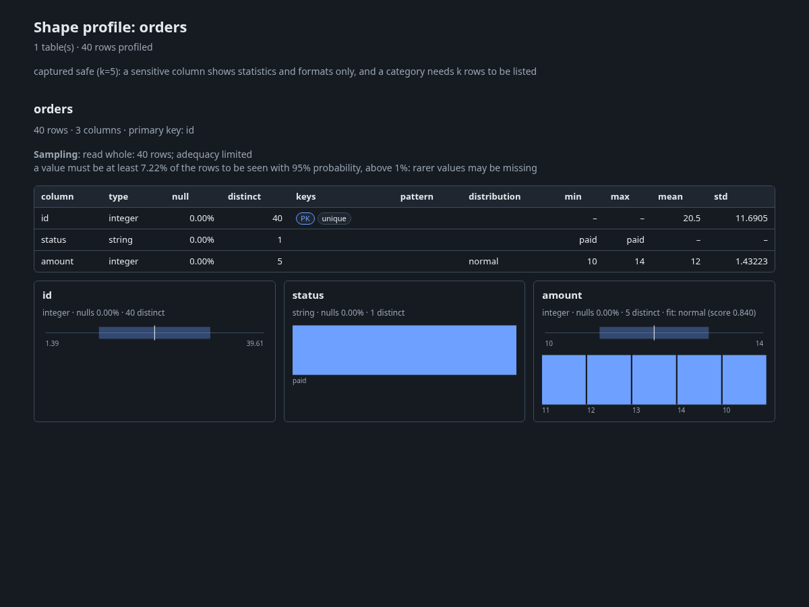

# Reading the HTML report

Review each section before you accept a profile as a baseline.

Status: available.

The report is one self-contained HTML file. The renderer in `src/shape/report/html.py`
uses inline CSS and SVG, with no scripts or external report assets. The first two
[starter tutorials](TUTORIAL.md) create the local report used in these screenshots.
The committed `scripts/docs_screenshots.py` regenerates them from the committed profile.

## Title and capture policy

The title gives the profile name. The line below gives table and row counts.
For a saved safe capture, the capture line gives the release threshold `k`.
A full capture warning means you handle the report like source data.
A safe capture is data minimisation, not anonymisation.

## Table summary and sampling

Each table heading gives its row count, column count and detected primary key.
The sampling line states how much input was examined. It can include internal sampling
used by individual analyses. Do not read a sample as proof about all rows.

## Column grid

Read the column name and inferred type first. `null` is the null rate, and `distinct`
is cardinality. `keys` shows detected key roles. `pattern` describes a detected format.
`distribution` names the fitted numeric family. Min, max, mean and std describe spread.
A blank or dash can mean a field is unavailable, inapplicable or suppressed. In particular,
sensitive extremes are withheld in a safe capture; missing evidence is not a zero value.

## Column cards

Cards expand the grid with counts, quantiles, format information and inline charts.
A category chart shows the released category mix. A numeric chart summarizes the
recorded distribution. Optional univariate, mixture and seasonality information appears
only when the profile contains it. Use the profile's adequacy and sampling record before
interpreting a small population.

## Joint structure and relationships

A joint-structure card appears when joint analysis has entries. It describes dependencies
and associations rather than proving a business rule. Dataset reports have a Relationships
section with child columns, parent columns and detected relationship type; an empty section
states that none were detected. The single-table tutorial does not have that section.

## What's next

[Write a contract](tutorials/04-contract.md) for the properties you actually require.
Do not turn every observed statistic into a rule.

## Related

[Read the report tutorial](tutorials/02-read-report.md) · [Anatomy](ANATOMY.md)
