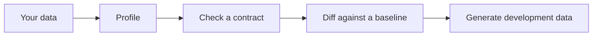
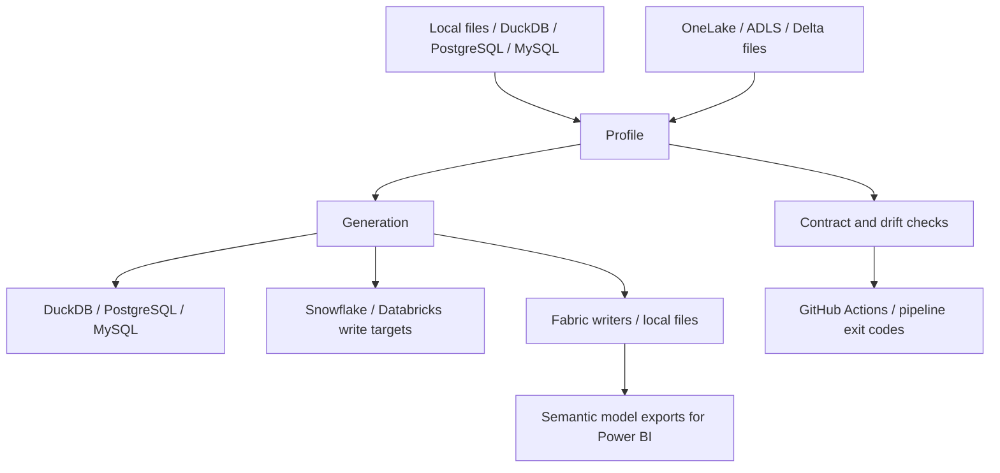

# Shape by SQLLocks

Profile your data, check a contract, compare drift and generate development rows.

Status: available.

**Early access 0.9.1.** Profiling, contracts and drift are available and supported. Generation from a profile is available and is being hardened. Other surfaces are experimental unless labelled available. The 1.x promises describe future policy.

Start with [your first profile](tutorials/01-first-profile.md). You create a local CSV,
save a `.shape` file and read its report. No cloud account is needed.
Then [write a contract](tutorials/04-contract.md),
[catch drift](tutorials/03-drift.md) and
[generate from your profile](tutorials/05-generate-profile.md).
Use [learning paths](LEARNING_PATHS.md) to choose the next step for your role.

A profile describes a table's types, counts, nulls, distributions and relationships.
A contract states what your data must satisfy. A diff shows how its behavior changes.
A safe capture is data minimisation, not anonymisation. You review it before sharing.

## Where platforms plug in

[Database pages](databases/index.md) describe shipped adapters. Snowflake and Databricks
are write targets; Shape does not profile from them yet. Cloud examples needing an account
stay owner placeholders until their commands have been run.

## Choose your next page

[Install](INSTALL.md) · [Concepts](CONCEPTS.md) · [Read the report](READ_REPORT.md) ·
[Troubleshooting](TROUBLESHOOTING.md) · [Known limitations](KNOWN_LIMITATIONS.md) ·
[Python API](API.md) · [Changelog](CHANGELOG.md)

Industry Profile Packs are coming with Premium, healthcare first:
[shapedata.ai](https://shapedata.ai/).
